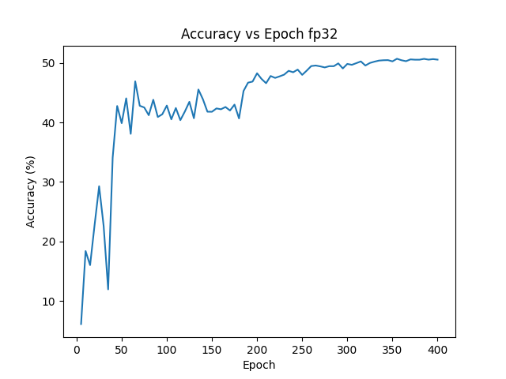
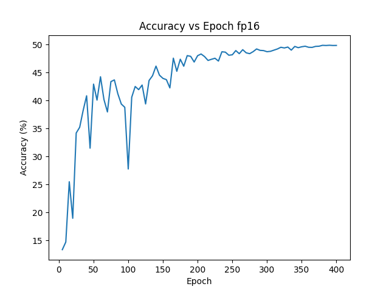

# Train ResNet-50 on CIFAR-100 from scratch

This is a class assignment.

It turns out convergence on distributed training is much harder than a single GPU, thus, several hyperparameters are tuned.

I tried to clip the gradient norm by using `clip_grad_by_norm` function provided by colossalai, but it seems to me that it is buggy and will lead loss to nan after tens of epochs.

## Details
Model used: ResNet-50 (from torchvision.models.resnet50)

Dataset employed: CIFAR-100 (from torchvision.datasets.CIFAR100)

Number of GPU: 4

To run the code and view output of my running, simply refer to the [run.ipynb](./run.ipynb) file

## Result

**FP32**

Final Accuracy: 50.56 %

Validation accuracy over epochs 

**FP16**

Final Accuracy: 49.82 %

Validation accuracy over epochs 

## 🚀 Quick Start

This example provides a training script and an evaluation script. The training script provides an example of training ResNet on CIFAR10 dataset from scratch.

- Training Arguments
  - `-p`, `--plugin`: Plugin to use. Choices: `torch_ddp`, `torch_ddp_fp16`, `low_level_zero`. Defaults to `torch_ddp`.
  - `-r`, `--resume`: Resume from checkpoint file path. Defaults to `-1`, which means not resuming.
  - `-c`, `--checkpoint`: The folder to save checkpoints. Defaults to `./checkpoint`.
  - `-i`, `--interval`: Epoch interval to save checkpoints. Defaults to `5`. If set to `0`, no checkpoint will be saved.
  - `--target_acc`: Target accuracy. Raise exception if not reached. Defaults to `None`.

- Eval Arguments
  - `-e`, `--epoch`: select the epoch to evaluate
  - `-c`, `--checkpoint`: the folder where checkpoints are found

### Install requirements

**Make sure you have compatible torch with cuda, the below line does not do so unless you have cuda=12.1** 
```bash
pip install -r requirements.txt
```

### Train
The folders will be created automatically.
```bash
# train with torch DDP with fp32
colossalai run --nproc_per_node 2 train.py -c ./ckpt-fp32

# train with torch DDP with mixed precision training
colossalai run --nproc_per_node 2 train.py -c ./ckpt-fp16 -p torch_ddp_fp16

# train with low level zero
colossalai run --nproc_per_node 2 train.py -c ./ckpt-low_level_zero -p low_level_zero
```

### Eval

```bash
# evaluate fp32 training
python eval.py -c ./ckpt-fp32 -e 80

# evaluate fp16 mixed precision training
python eval.py -c ./ckpt-fp16 -e 80

# evaluate low level zero training
python eval.py -c ./ckpt-low_level_zero -e 80
```


**Note: the code is adapted from an example provided by ColossalAI [link](https://github.com/hpcaitech/ColossalAI/tree/main/examples/images/resnet)**